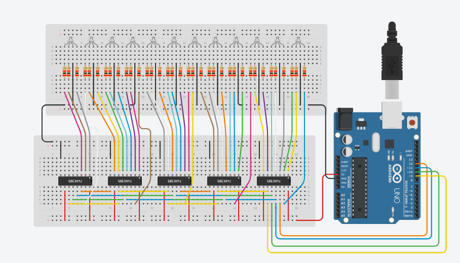

<h1>Project Arduino 12 Led RGB Dengan Modul 74hc595 Membuat Animasi Led</h1>

<h5>Gambar Rangkaian</h5>

<h5>Barang Barang Yang Dibutuhkan :</h5>
<ul>
  <li>Arduino Uno R3</li>
  <li>36x Resistor 100 Ohm</li>
  <li>± 60 Pcs Kabel Jumper Male To Male</li>
  <li>2x Breadboard 830P</li>
  <li>12x Led RGB Cathode</li>
  <li>5x Modul Shift Register 74HC595</li>
</ul>
